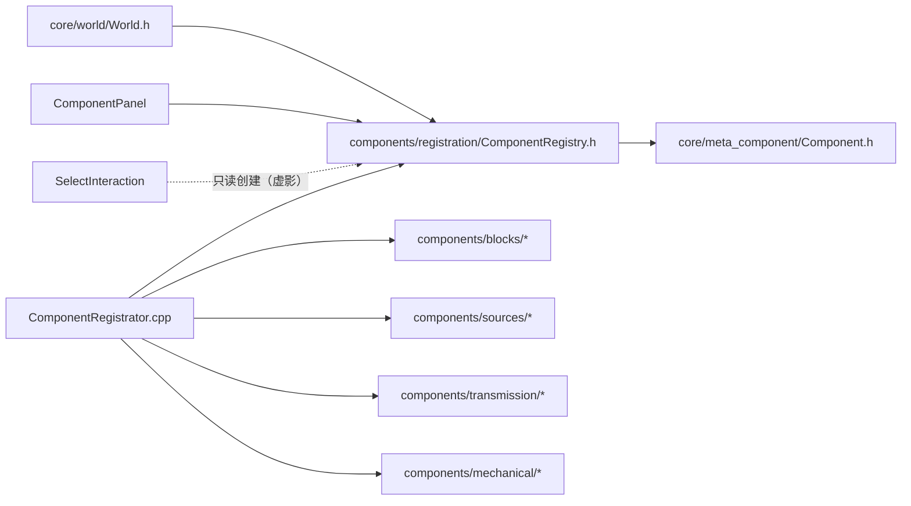

# ComponentRegistry — 元件注册中心（单例工厂 + 静态注册入口）

> 对应源码：`components/registration/ComponentRegistry.h/.cpp`、`ComponentRegistrator.h/.cpp`
> 运行时测试：无专门测试文件（注册模块测试待补，见第 7 节）

## 1. 职责定位

registration 模块是元件系统的**工厂注册表**：解决"按名字造对象"——高层只持有字符串 ID（如 `"lever"`）与 `Component*`，不依赖任何具体元件类。

两个类各司其职：

| 类 | 职责 |
|---|---|
| `ComponentRegistry` | 注册中心：元数据表 + 工厂函数表 + 按 ID 查询/创建（单例） |
| `ComponentRegistrator` | 注册入口：程序启动时集中注册全部元件类型（静态初始化） |

**核心价值**：新增元件 = 新类 + 注册入口加一行，UI/World/Engine 零改动（依赖反转：高层依赖抽象与 ID，具体类型只出现在注册表这一处）。

## 2. 成员一览

### ComponentRegistry（单例）

| 成员 | 类型 | 说明 |
|---|---|---|
| `m_entries` | `QList<Entry>` | 主数据区：`Entry = { ComponentMeta meta; FactoryFunc factory; }`，下标 = 注册顺序 |
| `m_idToIndex` | `QMap<QString, int>` | 字符串 ID → entries[] 下标（O(log n) 查询） |
| `m_categoriesInOrder` | `QStringList` | UI 分类列表（保持注册顺序，去重） |

### ComponentRegistrator

| 成员 | 类型 | 说明 |
|---|---|---|
| `g_componentRegistrationFlag` | `const bool` | 链接标志：静态库拆库后 main 引用该符号，防止含静态注册的对象文件被链接器裁剪 |

## 3. 接口清单

### ComponentRegistry

| 接口签名 | 说明 |
|---|---|
| `static ComponentRegistry& instance()` | 单例：静态局部变量，C++11 起线程安全 |
| `template<typename T> void registerType(id, name, group)` | 注册：自动生成工厂 lambda `[](int x, int y) { return std::make_unique<T>(x, y); }` |
| `const ComponentMeta* find(const QString &id) const` | 查询元数据（id / name / group，不创建实例），未注册返回 nullptr |
| `QStringList categories() const` | UI 分类列表（注册顺序） |
| `QList<const ComponentMeta*> defsByCategory(cat) const` | 按分类取元数据（ComponentPanel 填充树控件用） |
| `std::unique_ptr<Component> create(const QString &id, int x, int y) const` | **创建实例**（见第 4 节流程） |
| `QStringList allIds() const` | 全部已注册 ID |

### ComponentRegistrator

| 接口签名 | 说明 |
|---|---|
| `void registerComponents()` | 集中注册全部元件类型（内部 once 防重入） |
| `extern const bool g_componentRegistrationFlag` | 链接标志（main 引用以保留静态注册） |

## 4. 设计契约

### 4.1 创建实例的过程（重点）

`create(id, x, y)` 是唯一的实例化入口，四步：

```
create("lever", x, y)
  ├─ 1. 查表    m_idToIndex.find("lever")          // QMap<QString,int>，O(log n)
  ├─ 2. 失败    → return nullptr                    // 未注册 ID 安全返回
  ├─ 3. 调工厂  m_entries[idx].factory(x, y)        // std::function 调用注册时生成的 lambda
  │                → std::make_unique<Lever>(x, y)  // 多态：返回的是 Component*
  └─ 4. 授身份  comp->setRegistryId("lever")        // 字符串 ID 写回组件，组件知道"我是谁"
                → return unique_ptr<Component>      // 所有权交给调用方
```

**要点**：

- **工厂函数签名**：`using FactoryFunc = std::function<std::unique_ptr<Component>(int, int)>`——接收网格坐标，返回基类指针
- **模板自动生成工厂**：`registerType<T>()` 编译期生成 `make_unique<T>` lambda，注册方只需写类名，工厂样板零手写
- **多态创建**：C++ 无虚构造函数，"只知道 ID 不知道类"的创建只能靠查表分发——工厂表就是这张表
- **身份授予唯一路径**：`setRegistryId` 只在 create 内调用（全项目唯一写入方）；`registryId()` 消费方：Select 选中、虚影渲染、交互信号、未来存档类型标识
- **面向接口**：调用方拿到 `unique_ptr<Component>`，不 include 任何具体元件头文件

### 4.2 注册流程（静态初始化）

```
main 引用 g_componentRegistrationFlag（链接标志，防静态库裁剪）
  → 全局初始化执行 (registerComponents(), true)
  → 依次 registerType<SolidBlock / Lever / RedstoneDustLine / ...>（9 种）
  → 每项：元数据入 m_entries + id 索引 + 分类去重
```

- **集中注册**：所有元件类型集中在 `ComponentRegistrator.cpp` 列出，新增元件改一处
- **once 防重入**：`registerComponents` 内静态 bool，重复调用无害

### 4.3 其他契约

- **重复 ID 防护**（2026-08-04 新增）：`registerType` 检查 `m_idToIndex.contains(id)`，冲突即程序员错误 → `qWarning` 告警 + **拒绝注册**（此前静默覆盖导致 find 错乱、面板重复）
- **字符串 ID 单一轨道**：`numericId` 双轨（findByNumericId / createByNumericId）已删除（2026-08-04）——零消费 + 存档方案（2.6 快照）明确用字符串 `registryId()` 作类型标识
- **空安全**：未注册 ID 的 find / create 均返回 nullptr（nullptr / 空指针，不抛异常）

## 5. 使用约定

- **编辑创建**：只有 `World::placeComponent` 调用 `create`（UI 不直接碰 Registry）
- **表现层例外**：SelectInteraction 虚影渲染需临时实例画预览，直用 `create(id, 0, 0)`（只读创建，不入网格）
- **面板填充**：ComponentPanel 用 `categories()` + `defsByCategory()` 构建分类树
- **新增元件流程**：① 新类继承 Component ② `ComponentRegistrator.cpp` 加一行 `registerType`（ID 全局唯一，撞车会告警）——其余层零改动

## 6. 模块关系



- 上游（依赖 Registry）：World（编辑创建）、ComponentPanel（面板填充）、SelectInteraction（虚影渲染）
- 下游依赖：Component（返回/存储类型）、各具体元件类（仅 Registrator.cpp 一处 include）
- 依赖方向：具体元件类**只**被 Registrator 引用——高层（World/UI）永远不 include 具体类

## 7. 测试验证

当前**无专门单元测试文件**（注册模块测试归入元件重构后的测试批次，见 v0.3.0-plan 2.4.2）。待补用例：

| 契约 | 用例 |
|---|---|
| 注册 → find / allIds / categories 查询 | `registry_query_*` |
| create 成功（类型正确 + registryId 已写入） | `create_setsRegistryId` |
| create / find 未注册 ID 返回空 | `create_unknownId_returnsNull` |
| 重复 ID 拒绝注册（第二次被忽略） | `duplicateId_rejected` |
| 分类分组查询 | `defsByCategory_*` |

## 8. 变更历史

| 日期 | 变更 |
|---|---|
| 2026-08-04 | 删除 numericId 死轨道（`ComponentMeta::numericId` / `m_numericIdToIndex` / `m_nextNumericId` / `findByNumericId` / `createByNumericId`）——零消费 + 存档方案用字符串 ID；顺带消除"createByNumericId 创建后未 setRegistryId"的身份不一致隐患 |
| 2026-08-04 | `registerType` 新增重复 ID 防护：qWarning + 拒绝注册（此前静默覆盖） |
| 2026-08-04 | 首次成文（按当前最终代码） |
