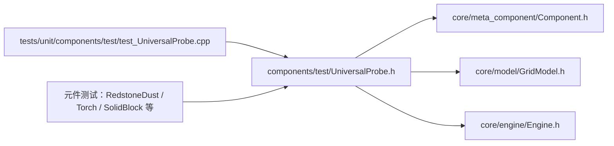

# UniversalProbe — 万能测试探针（测试替身）

> 对应源码：`components/test/UniversalProbe.h`（header-only，未编入生产库）
> 运行时测试：`tests/unit/components/test/test_UniversalProbe.cpp`（5 用例，已落地）

## 1. 职责定位

元件单元测试的**测试替身（test double）**，只提供两项能力：

1. **准确信号源**：可配置输出强度（0-15）与强弱充能——替代真实信号源（拉杆/红石块固定 0/15 且都是强充能，无法覆盖"强度 7 的弱充能"等场景）
2. **按方向取信号**：按方向查询自身收到的完整信号——替代真实消费者（灯/火把有延迟状态机，中间态不可读，无法断言精确强度）

按角色（`Role`）扮演源 / 接收器 / 同时担任。**不进 ComponentRegistry**（避免污染 UI 面板），测试内直接构造 + 放入网格。

## 2. 成员一览

| 成员 | 类型 | 说明 |
|---|---|---|
| `m_role` | `Role` | 角色：Source / Receiver / Both |
| `m_sourceStrength` | `int` | 配置的输出强度（0-15），Engine Phase 1 每次读取 |
| `m_strong` | `bool` | 是否强充能输出 |
| `m_received` | `std::array<RedstoneSignal, 4>` | 按方向最近收到的信号（索引 = `static_cast<int>(Direction)`，默认空信号） |

## 3. 接口清单

| 接口签名 | 说明 |
|---|---|
| `UniversalProbe(int x, int y, Role role = Receiver)` | 构造（全向输入/输出端口） |
| `enum class Role { Source, Receiver, Both }` | Source=仅信号源；Receiver=仅接收器；Both=同时担任 |
| `void setSourceStrength(int)` | 源侧：配置输出强度 0-15（tick 间可改） |
| `void setStrongOutputEnabled(bool)` | 源侧：切换强/弱充能输出 |
| `int configuredStrength() const` | 源侧：当前配置强度 |
| `RedstoneSignal receivedSignal(Direction) const` | **接收侧：按方向查询收到的信号**（方向 = 信号来源方向；未收到返回空信号） |

## 4. 设计契约

### 4.1 准确信号源的工作机制

```
测试配置 setSourceStrength(7)
  → Engine Phase 1: setOutputStrength(basePowerLevel())   // basePowerLevel 返回配置值
  → Engine Phase 2: computeOutput() 保持配置强度           // 防被 BFS 按邻居信号改写
  → 邻居 signalFrom() 读到 7 + isStrong（可配）
```

- 强度改动在两次 tick 之间生效（Phase 1 每次重读 `basePowerLevel`），无需重建元件
- **`computeOutput` 必须覆盖**：源探针输出不依赖邻居，不覆盖会被 BFS 按邻居信号清零导致链路中断

### 4.2 按方向取信号的工作机制

```
Engine Phase 3: onTick(sigArray)   // sigArray = 四方向输入，引擎缓存已物化
  → m_received = sigArray          // 整体快照
查询: receivedSignal(Direction::North) → m_received[static_cast<int>(North)]
```

- **方向语义**：`Direction` = 信号来源方向（与 `GridModel::signalFrom(x, y, dir)` 一致：North = 北邻居发出的信号）
- 索引约定与引擎缓存一致（North=0, East=1, South=2, West=3）
- 无信号方向返回默认空信号（strength=0, direction=None, isStrong=false）

### 4.3 全向端口（易踩坑）

`GridModel::signalFrom` 会查 `neighbor->canOutputTo(signalDir)`——探针输出端口**必须全向声明**（{Front,Right,Back,Left}），否则作为源时邻居收不到信号。

### 4.4 角色与引擎接口映射

| 角色 | isSignalSource | isConsumer | 行为 |
|---|---|---|---|
| Source | true | false | 进 BFS 传播，不接收 |
| Receiver | false | true | 输出清零，Phase 3 记录信号 |
| Both | true | true | 既传播又接收（组合测试中间节点） |

### 4.5 接口防腐层

- **公共接口按领域语义**（准确强度/强弱充能/方向信号），方向由接口参数表达，**不依赖 `RedstoneSignal.direction` 字段**（计划删除的死字段）
- 旧架构适配层 = 虚函数覆盖（`isSignalSource`/`basePowerLevel`/`computeOutput`/`onTick` 等），未来"信号与充能内聚到元件内部"重构后整体重写，测试代码零改动

## 5. 使用约定

- **放置方式**：测试内直接 `grid.placeComponent(x, y, std::move(probe))`，不经过 Registry、不需要 registryId
- **三件套模式**（元件单测主体）：`Source(强度N) → 被测元件 → Receiver`，一个 `processTick` 后断言 `receivedSignal`
- **改强度前保留裸指针**：`auto *srcPtr = source.get();` 再 `std::move`——move 后 unique_ptr 为空，直接 `source->` 会崩溃
- **组合测试中间节点**：`Role::Both` 同时供能与观测
- **坐标方向核对**：(x, y) 的北邻居是 (x, y-1)、南邻居是 (x, y+1)，断言方向时先确认邻居位置

## 6. 模块关系



- 探针依赖 Component（继承）+ GridModel/Engine（测试驱动）
- 被元件测试文件 include（header-only，零 CMake 改动）
- 与 production 库（redstone-2d-components）无关联：CMakeLists 显式列源文件，`components/test/` 不会编入

## 7. 测试验证

`test_UniversalProbe`（5 用例，2026-08-04 全绿）：

| 用例 | 断言契约 |
|---|---|
| `source_outputsConfiguredStrength` | 源输出 15；接收探针 North=15、South=0（方向隔离） |
| `source_weakAndStrongFlag` | 强度 7+强充能 → `isStrong==true`；切换弱充能 → false |
| `receiver_readsDirectionalSignal` | 15→7 两 tick，方向查询反映最新值；三面无信号 |
| `receiver_isolated_readsZero` | 无信号环境四方向空信号 |
| `both_role_simultaneous` | 输出保持配置 + 收到邻居信号（Both 兼任） |

## 8. 变更历史

| 日期 | 变更 |
|---|---|
| 2026-08-04 | 删除聚合观测接口（lastStrength/peakStrength/changeCount/strengthHistory/clearHistory）——需求收敛为"准确信号源 + 按方向取信号"（YAGNI，时序断言需求出现时再加） |
| 2026-08-04 | 接收接口改为按方向返回完整 `RedstoneSignal`（`receivedSignal(Direction)`），方向由参数表达不依赖死字段，为 RedstoneSignal.h 重构做准备 |
| 2026-08-04 | 首次成文（三角色 + 强弱充能可配，header-only） |
