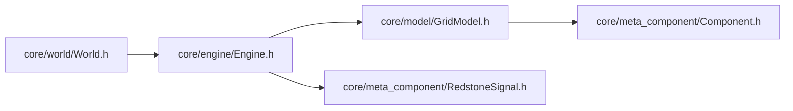

# Engine — 仿真引擎（步进逻辑）

> 对应源码：`core/engine/Engine.h`、`core/engine/Engine.cpp`
> 运行时测试：无专门测试文件（全链路场景测试待补，见第 7 节）

## 1. 职责定位

Engine 负责红石电路的 **tick 步进逻辑**：三阶段信号传播（信号源初始化 → BFS 传播 → 消费者响应）加上信号快照物化。它是无 QObject 的纯逻辑类，**只依赖 GridModel（只读），不感知 World/UI 的存在**。

## 2. 成员一览

| 成员 | 类型 | 说明 |
|---|---|---|
| `m_signalCache` | `vector<vector<array<RedstoneSignal, 4>>>` | 信号快照：`cache[x][y][dirIndex]`，dirIndex = Direction 枚举值（North=0, East=1, South=2, West=3）；Phase 3 消费者取输入用（2.5 计划删除，见第 7 节） |
| `m_bfsQueue` | `vector<Component*>` | BFS 队列缓冲（成员复用：clear 保留 capacity，热路径零分配） |
| `m_bfsHead` | `size_t` | 队列头索引（已处理元素数量），避免 pop 移动数据 |

## 3. 接口清单

| 接口签名 | 说明 |
|---|---|
| `Engine()` / `~Engine()` | 构造/析构（拷贝与赋值已删除） |
| `void processTick(GridModel *grid)` | 执行一个 tick：Phase 1 → 2 → 2.5 → 3（见设计契约） |

## 4. 设计契约

### tick 内部四阶段

```
Phase 1   信号源初始化 & 传输线清零（稀疏遍历 activeComponents）
          信号源 setOutputStrength(basePowerLevel)；非参与元件清零输出（防残留）
Phase 2   BFS 信号传播（队列 + 实时查询）
          出队元件 computeOutput(grid) 重算输出；输出变化 → 通知四方向可传播邻居入队
Phase 2.5 构建信号快照（全网格 × 4 方向物化）
          buildSignalCache：cache[x][y][dir] = grid->signalFrom(x, y, dir)
Phase 3   消费者响应（稀疏遍历 activeComponents）
          isConsumer 元件 onTick(m_signalCache[x][y]) 读预计算信号
```

- **稀疏遍历**：Phase 1 / Phase 3 只走 `grid->activeComponents()`，不扫描空气格（2.2 落地）
- **BFS 实时查询**：Phase 2 传播过程中 `computeOutput` 直接调 `grid->signalFrom` 实时查邻居输出——传播不依赖快照，快照只服务 Phase 3 消费者（2.5 架构约束：传播与缓存隔离）
- **热路径零分配**：`m_bfsQueue` 成员复用（`clear()` 保留 capacity），tick 内不产生堆分配
- **只读 GridModel**：Engine 不修改网格结构（不 place/remove）；元件标记清理由 World 在 tick 后统一执行
- **无 World/UI 依赖**：`processTick(GridModel*)`——引擎可独立测试、独立复用

## 5. 使用约定

- **唯一调用方**：`World::singleTick()`（`m_engine->processTick(m_grid.get())`）
- 禁止在 UI 层直接调用 Engine；需要仿真能力一律走 World（start/stop/singleTick/setSpeed）
- Engine 为值语义（unique_ptr 持有），不跨线程——单线程主循环驱动

## 6. 模块关系



- 上游（依赖 Engine）：World（唯一调用方）
- 下游依赖：GridModel（只读）、Component（activeComponents 元素类型）、RedstoneSignal（快照元素类型）、Direction（下标契约）
- **不依赖**：World / UI / 任何 QObject

## 7. 测试验证

当前**无专门单元测试文件**。待补（v0.3.0-plan 2.5 已列为前置条件）：

| 契约 | 用例 |
|---|---|
| 拉杆 → 粉 → 火把 → 灯 全链路（多 tick 时序） | `Engine_fullLink_scenario` |
| 输出变化才传播（不变不扩散） | `Engine_noChange_noPropagate` |
| 非参与元件输出清零（防残留） | `Engine_resetNonActive` |
| 消费者收到正确方向信号（下标契约） | `Engine_consumerSignal_indexed` |

### 未来重构方向（2.5 信号模型重构）

- 删除 `m_signalCache` / `buildSignalCache`（全网格 O(W×H×4) 物化，空格子也查，违背稀疏目标）
- 信号下沉为 Component 内部缓存 `m_inputs[4]`；Phase 3 前对活动消费者逐格 `refreshInputs(grid)`（实时查邻居 + canInputFrom 端口过滤）
- `onTick()` 改无参读自身缓存；BFS 传播保持实时查询不变

## 8. 变更历史

| 日期 | 变更 |
|---|---|
| 2026-08-04 | `processTick(World*)` → `processTick(GridModel*)`：Engine 去 World 依赖（四层职责划分共识），World.cpp 同步改调 |
| 2026-08-04 | 首次成文（按当前最终代码：四阶段 tick + 稀疏遍历 + BFS 缓冲复用） |
