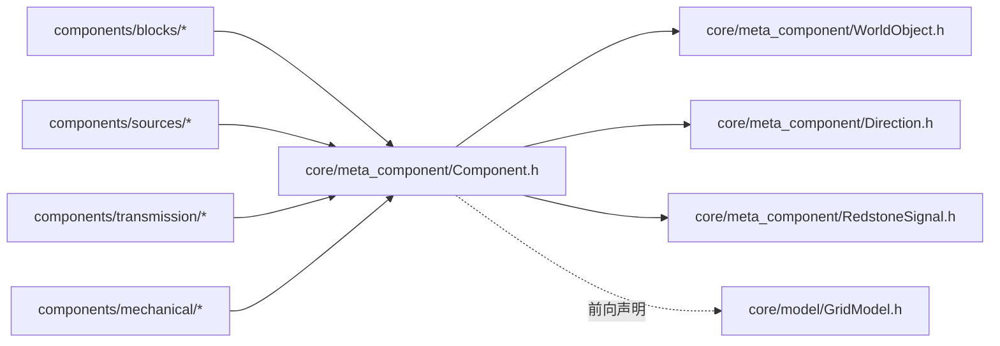

# Component — 红石元件抽象基类

> 对应源码：`core/meta_component/Component.h`、`core/meta_component/Component.cpp`
> 运行时测试：无直接单元测试（抽象基类，行为由具体元件测试覆盖）

## 1. 职责定位

Component 是所有红石元件的抽象基类，继承 [WorldObject](./WorldObject.md)（网格占位 + 朝向 + 渲染），在此之上提供完整的红石逻辑：

- **物理属性**：Category 分类（Air/Solid/NonSolid）、可推动性、基础输出强度
- **端口系统**：输入/输出端口（RelDir 相对方向声明），`canInputFrom` / `canOutputTo` 查询
- **信号系统**：信号源/中继/消费分类、输出强度、强弱充能、Phase 2 输出计算
- **交互与生命周期**：`onInteract`、`onTick`、待销毁标记
- **注册 ID**：关联 ComponentRegistry 中的 entry

## 2. 枚举语义

### Category（方块类型）

| 枚举值 | 含义 |
|---|---|
| Air | 空气，不参与任何逻辑 |
| Solid | 实心方块，可被强/弱充能，阻挡信号穿过 |
| NonSolid | 非固体（红石线、火把等），信号可穿过 |

Category 决定物理交互行为，是元件最基础的自描述属性。

## 3. 接口清单

### 物理属性（子类自声明）

| 接口签名 | 说明 |
|---|---|
| `virtual Category category() const = 0` | 纯虚，子类必须声明自身分类 |
| `virtual bool isPushable() const` | 是否可被活塞推动，默认 false |
| `virtual int basePowerLevel() const` | 基础输出强度，默认 0 |
| `bool isSolid() const` | 便捷判断：`category() == Category::Solid` |

### 端口查询

| 接口签名 | 说明 |
|---|---|
| `const QList<RelDir>& inputPorts() const` | 输入端口（相对方向列表） |
| `const QList<RelDir>& outputPorts() const` | 输出端口（相对方向列表） |
| `bool canInputFrom(Direction absDir) const` | 绝对方向是否能输入：`toRelativeDir(absDir, facing())` 后查表 |
| `bool canOutputTo(Direction absDir) const` | 绝对方向是否能输出：同上查输出表 |

### 虚方法（子类按需重写）

| 接口签名 | 说明 |
|---|---|
| `virtual void onInteract()` | 交互回调（拉杆、按钮等），默认空 |
| `virtual void onTick(const std::array<RedstoneSignal, 4>& sigArray)` | 引擎 Phase 3 传入预计算的 4 方向信号，默认空 |
| `virtual bool isSignalSource() const` | 是否为信号源，默认 false |
| `virtual bool isTransceiver() const` | 是否为中继（传输元件），默认 false |
| `virtual bool isConsumer() const` | 是否为消费方（参与 tick 迭代），默认 false |
| `virtual bool isMarkedForRemoval() const` | 是否待销毁（tick 结束后由 World 统一清理），默认 false |
| `virtual bool isStrongOutput() const` | 输出是否为强充能（弱充能不可激活传输元件），默认 false |
| `virtual void computeOutput(GridModel *grid)` | Phase 2 BFS：根据邻居信号重新计算自身输出，默认空（不改输出） |

### 信号状态与注册

| 接口签名 | 说明 |
|---|---|
| `int outputStrength() const` / `void setOutputStrength(int)` | 当前输出强度读写 |
| `const QString& registryId() const` / `void setRegistryId(const QString&)` | 注册 ID（关联 ComponentRegistry entry） |

## 4. 设计契约

- **端口用 RelDir 声明**：端口是元件的自描述属性，以相对方向（Front/Right/Back/Left）声明，与朝向无关——元件旋转后端口不失效；对外查询（`canInputFrom` / `canOutputTo`）接收绝对方向，内部通过 `toRelativeDir` 转换
- **onTick 的 sigArray 下标 = Direction 枚举值**：`North=0, East=1, South=2, West=3`（与 Engine 的 SignalCache 布局一致），元件按下标取对应方向的输入信号
- **computeOutput 默认空实现**：无输入输出需求的普通元件（纯信号源等）无需重写；传输/消费元件必须实现 Phase 2 计算逻辑
- **强弱充能语义**：`isStrongOutput()` 为 false 的元件输出为弱充能，不可激活传输元件（红石粉、火把等）；isStrong 的传播路径见 [RedstoneSignal.md](./RedstoneSignal.md)
- **待销毁延迟清理**：元件自标记 `isMarkedForRemoval`，由 World 在 tick 结束后统一清理，避免迭代中删除

## 5. 使用约定

- 具体元件必须实现：`category()`（纯虚）+ `paintContent()`（继承自 WorldObject 的纯虚）；按需重写 `onInteract()` / `onTick()` / `isPushable()` / `basePowerLevel()` 等
- 子类构造时通过 Component 构造参数传入端口列表：`Component(x, y, facing, inputPorts, outputPorts)`
- 信号源类元件：`isSignalSource() = true`，在 `computeOutput` 中固定输出 `basePowerLevel()`（或交互改变）
- 传输类元件（红石粉、火把等）：`isTransceiver() = true`，实现 `computeOutput` 按输入聚合输出，见各元件文档

## 6. 模块关系

- 上游（依赖 Component）：全部具体元件——blocks（SolidBlock、DirectionalBlock）、sources（Lever、RedstoneBlock）、transmission（RedstoneDust、RedstoneTorch 系列）、mechanical（RedstoneLamp）
- 下游依赖：WorldObject（继承）、Direction（端口转换）、RedstoneSignal（onTick 参数）、GridModel（computeOutput 参数，前向声明）

## 7. 测试验证

无直接单元测试文件：Component 为抽象基类，其行为契约（端口转换、tick 签名、强弱充能）由具体元件测试与引擎集成测试覆盖。已落地单元测试见 [Direction.md](./Direction.md)、[WorldObject.md](./WorldObject.md)。

## 8. 变更历史

| 日期 | 变更 |
|---|---|
| 2026-08-04 | 继承 WorldObject：网格占位、朝向、渲染成员（m_x/m_y/m_facing、paint/paintContent）下沉至基类；本类保留 Category、端口、信号、交互、注册 ID 等红石逻辑 |
