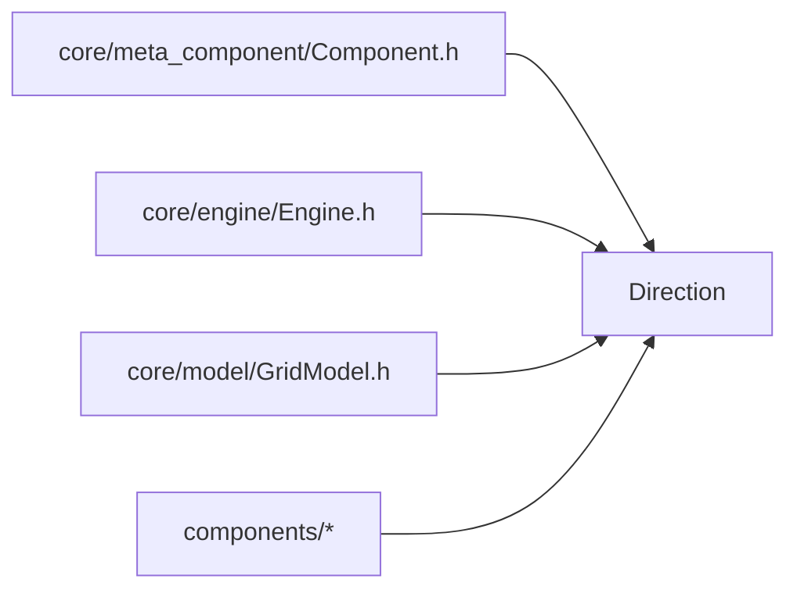

# Direction — 方向系统（严格 2D）

> 对应源码：`core/meta_component/Direction.h`
> 运行时测试：`tests/unit/core/meta_component/test_Direction.cpp`

## 1. 职责定位

Direction.h 提供世界绝对方向与元件相对方向的纯代数模型，全部为无状态纯函数：

- **严格 2D**：仅水平四方向（North/East/South/West），无上下维度；3D 推广属未来从头设计，不为 3D 预留任何抽象
- **零开销**：全部函数以 `constexpr` 声明，编译期即可求值、参与 `static_assert` 编译期校验，运行时无任何成本（constexpr 隐含 inline）
- **异常安全**：全部函数以 `noexcept` 声明——纯整数取余运算不存在失败路径，不抛异常是硬承诺，同时使调用方可以放心在热路径（引擎 tick 内）直接调用
- **取余模型**：顺时针枚举索引 + 模 4 运算实现旋转与映射，枚举顺序是全部运算的前提

## 2. 枚举语义

### Direction（绝对方向）

| 枚举值 | 索引 | 含义 |
|---|---|---|
| North | 0 | 北（上） |
| East | 1 | 东（右） |
| South | 2 | 南（下） |
| West | 3 | 西（左） |
| None | 4 | 无方向 |

索引按**顺时针**排列：N → E → S → W → N，`(i + 1) % 4` 即右旋 90°。

### RelDir（相对方向，相对元件朝向）

| 枚举值 | 索引 | 含义 |
|---|---|---|
| Front | 0 | 正面 = m_facing |
| Right | 1 | 右侧 = 顺时针 90° |
| Back | 2 | 背面 |
| Left | 3 | 左侧 = 逆时针 90° |

### kDirectionCount

水平方向总数常量 = 4，作为全部取余运算的模数；所有运算表达式统一使用 `% kDirectionCount`，不散落魔法数字 4。

## 3. 函数清单

| 函数签名 | 说明 |
|---|---|
| `opposite(Direction)` | 反方向：`(i + 2) % 4`；None 幂等（None → None） |
| `rotateRight(Direction)` | 右旋 90°（顺时针）：`(i + 1) % 4` |
| `rotateLeft(Direction)` | 左旋 90°（逆时针）：`(i + 3) % 4` |
| `toRelativeDir(d, facing)` | 双向映射之一：绝对 → 相对（已知朝向 facing，绝对方向 d 是哪一侧） |
| `toAbsoluteDir(side, facing)` | 双向映射之二：相对 → 绝对（facing 的 side 侧是哪个绝对方向） |
| `opposite(RelDir)` | 相对方向反侧：Front ↔ Back、Right ↔ Left |
| `dx(Direction)` | x 偏移：East +1 / West -1 / 其他 0 |
| `dy(Direction)` | y 偏移：South +1 / North -1 / 其他 0（屏幕坐标 Y 向下） |
| `allDirections()` | 全部水平方向，按顺时针排列（遍历用） |

全部函数均为 `constexpr noexcept`。

## 4. 设计契约

- **枚举顺序契约**：North=0、East=1、South=2、West=3 顺时针排列是取余运算的前提；通过 `static_cast` 将强类型枚举显式转为整数参与运算，再转回枚举（`static_cast<Direction>`）——整个过程由文末 static_assert 契约组在编译期锁定：改动枚举顺序会直接编译失败，而非静默算错
- **None 语义**：方向运算对 None 幂等（`opposite(None) == None`、旋转同理）；`toAbsoluteDir(side, None) == None`；`toRelativeDir` 在任一参数为 None 时返回 Front（实际调用不会出现，仅为穷尽性保证）
- **代数不变量**（static_assert 编译期 + 运行时测试双重锁定）：
  - 转两次 = 反向：`rotateRight(rotateRight(d)) == opposite(d)`（rotateLeft 同理）
  - 转四次 = 恒等：`rotate⁴(d) == d`
  - 双向映射互逆：`toAbsoluteDir(toRelativeDir(d, facing), facing) == d`（全 16 组合）
  - 恒等映射：`toRelativeDir(facing, facing) == RelDir::Front`
- **命名统一**：双向映射统一 `to` 前缀 + 目标类型命名（`toRelativeDir` / `toAbsoluteDir`），函数名即表达转换方向
- **dx/dy 单向映射**：仅提供方向 → 偏移；反向（偏移 → 方向）未实现——(0,0) 偏移对多个方向均有歧义，需要时用 `allDirections()` 遍历匹配即可（YAGNI）

## 5. 使用约定

- **端口语义用 RelDir**（元件自描述）：`Component::canInputFrom` / `canOutputTo` 以相对侧声明端口，与朝向无关，旋转后端口不失效
- **世界访问用 Direction**（外部坐标）：如 RedstoneTorchWall 附着校验先 `toAbsoluteDir(RelDir::Back, facing())` 得到附着面世界方向，再叠加 `dx/dy` 取邻居坐标
- 组件存储 `m_facing` 为 Direction；渲染与交互按 facing 旋转
- 邻格遍历：`dx/dy + allDirections()` 组合

## 6. 模块关系

- 上游（依赖 Direction）：组件基类端口判定、引擎邻格传播、GridModel 寻址辅助
- 无下游依赖：纯值头文件，仅依赖 `<array>` 标准库

## 7. 测试验证

测试文件：`tests/unit/core/meta_component/test_Direction.cpp`（13 组，标签 `unit`）

| 不变量 / 契约 | 编译期 static_assert | 运行时 test_Direction |
|---|---|---|
| 枚举索引顺序 | 5 条 | `enumIndex_contract` |
| opposite 值表 | 5 条 | `opposite_values` |
| rotateRight / rotateLeft 值表 | 8 条 | `rotateRight_values` / `rotateLeft_values` |
| 转两次 = 反向 | 2 条 | `rotateTwice_isOpposite` |
| 转四次 = 恒等 | — | `rotateFourTimes_isIdentity` |
| 相对侧反侧 | 4 条 | `relDirOpposite_pairs` |
| 恒等映射 = Front | — | `relativeDir_identity_isFront` |
| toRelativeDir 全 16 组合 | — | `toRelativeDir_fullTable` |
| toAbsoluteDir 全 16 组合 | — | `toAbsoluteDir_fullTable` |
| 双向互逆 roundtrip | 4 条 | `mapping_roundtrip` |
| dx/dy 值表 | 4 条 | `dxdy_values` |
| allDirections 顺序 | — | `allDirections_order` |

**互补关系**：static_assert 在编译期锁定（有人改动枚举顺序 → 编译失败）；运行时测试覆盖全 16 组合值表，失败时输出可读的期望/实际对比。二者缺一不可——编译期保证"改错就建不了"，运行时保证"行为变化看得见"。

## 8. 变更历史

| 日期 | 变更 |
|---|---|
| 2026-08-04 | `resolveDir` 重命名为 `toAbsoluteDir`（双向映射统一 to 前缀）；新增 `kDirectionCount` 常量、`opposite(RelDir)`、static_assert 契约组；`toRelativeDir`/`toAbsoluteDir`/`allDirections` 由 inline 升级为 constexpr |
| 2026-06-30 | 首次成文（8 节模板，与 test_Direction 同步落地） |
