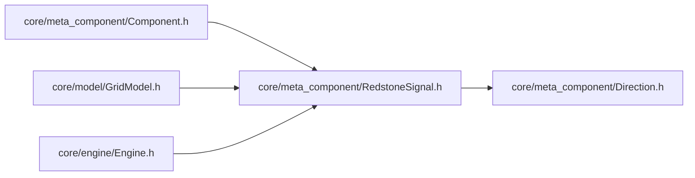

# RedstoneSignal — 红石信号结构体

> 对应源码：`core/meta_component/RedstoneSignal.h`
> 运行时测试：无专门测试文件（纯数据结构，字段语义由引擎与元件测试覆盖）

## 1. 职责定位

RedstoneSignal 是红石信号的**完整描述载体**：一个方向上的输入信号（强度 + 传播方向 + 充能类型）。它是纯数据 POD 结构，无任何方法，在引擎与元件之间传递信号信息。

**命名避让**：刻意避开 Qt 的 `signal` 关键字，防止与 Qt 信号槽机制混淆。

## 2. 字段语义

| 字段 | 类型 | 说明 |
|---|---|---|
| `strength` | int | 信号强度 0-15 |
| `direction` | Direction | 信号传播方向（指向的方向，即信号进入本格时来自的方向） |
| `isStrong` | bool | 是否为强充能 |

### 消费语义

- 消费方根据 `isStrong` 决定信号是否可用：**弱充能不能激活传输元件**（红石粉、火把等）
- `direction` 为信号传播方向：例如 `signalFrom(x, y, fromDir)` 返回的信号，其 `direction` 指向本格（即从 `fromDir` 邻居传来）

## 3. 设计契约

- **强度与充能类型正交**：`strength` 是纯强度值，`isStrong` 是布尔标志，二者独立——同强度可对应不同 isStrong，反之亦然
- **充能聚合规则**（消费方聚合多个方向输入时）：强度取所有方向最大值（max），强充能标志为布尔取或（任一方向强充能即强充能）——见"红石充能与防自激核心规则"
- **direction 语义固定**：永远是"传播方向/指向方向"，即进入当前格的方向；不随消费方视角变化
- **零成本**：POD 结构，无构造/析构开销，可直接放入 `std::array` / `std::vector` 密集存储（引擎 SignalCache 按 `[x][y][dirIndex]` 布局）

## 4. 使用约定

- **查询入口**：`GridModel::signalFrom(x, y, fromDir)` 构造信号——从 `fromDir` 方向邻居取信号，校验邻居 `canOutputTo` 后填充 `strength`（`outputStrength()`）、`direction`（`signalDir`）、`isStrong`（`isStrongOutput()`）
- **引擎快照**：Engine Phase 1 通过 `buildSignalCache` 按 `allDirections()` 顺序（North=0, East=1, South=2, West=3）预计算全网格信号快照，缓存数组下标即 Direction 枚举值
- **元件消费**：`Component::onTick(sigArray)` 接收 4 方向预计算信号，按下标取对应方向输入
- **空信号**：不可达方向（邻居为空或 `canOutputTo` 失败）返回 `{}`，即 strength=0、direction=None、isStrong=false

## 5. 模块关系

- 上游（依赖 RedstoneSignal）：Component（onTick 参数）、GridModel（signalFrom 返回类型）、Engine（SignalCache 元素类型）
- 下游依赖：Direction.h（direction 字段类型，信号方向语义复用方向模型）

## 6. 测试验证

无专门测试文件：结构体为字段级数据载体，其语义（isStrong 决定传输激活、direction 指向语义、聚合 max/取或规则）通过引擎集成测试与具体元件（SolidBlock、RedstoneDust 等）测试覆盖。

## 7. 未来的重构方向：取消 direction 字段

**目标**：RedstoneSignal 精简为两字段（`strength` + `isStrong`），方向语义完全由承载容器与元件接口决定，结构体不再携带方向。

### 7.1 重构依据（现状核查）

- **direction 是死字段**：全项目仅 1 处写入（`GridModel::signalFrom` 的 `.direction = signalDir`），0 处读取——写入后从未被任何消费方访问
- **方向信息已有三个承载者**，不依赖字段：
  - `signalFrom(x, y, fromDir)` 的 `fromDir` 参数——调用方传方向、自己知道方向
  - `onTick(sigArray)` 的数组下标——`North=0, East=1, South=2, West=3` 即 Direction 枚举值
  - 元件端口接口 `canInputFrom` / `canOutputTo`——以 RelDir 相对方向声明，内部 `toRelativeDir` 转换，决定输入输出方向
- **输入输出的方向由元件接口决定**：消费方（SolidBlock、RedstoneDust、RedstoneTorchBase、RedstoneLamp 等）一律先 `canInputFrom(dir)` 校验端口，再按下标/参数取信号；方向语义属于调用约定，不属于信号数据本身

### 7.2 重构范围（改动点清单）

| 文件 | 改动 |
|---|---|
| `core/meta_component/RedstoneSignal.h` | 删除 `direction` 字段，注释同步（改为两字段说明） |
| `core/model/GridModel.cpp` `signalFrom` | 删除 `.direction = signalDir` 赋值，保留 strength / isStrong |
| `core/meta_component/Component.h` | `onTick` 注释补充"方向由数组下标承载" |
| `core/engine/Engine.h` | SignalCache 注释微调（可选，现注释已说明下标布局） |
| 本文档 + [Direction.md](./Direction.md) 使用约定节 | 同步删除 direction 相关表述 |

**测试影响**：无——direction 无消费方，删除字段不触碰任何断言；现有单元/场景测试全部保持通过（预期零改动）。

### 7.3 未来影响

**正向收益**：
- 结构体体积缩减，SignalCache 快照内存占用降低（POD 更紧凑）
- 方向语义单一来源：由容器下标 / 接口参数决定，消除"字段值与下标不一致"的双源漂移风险
- 与"元件内部信号缓存"演进方向一致：若未来信号缓存沉入元件内部，方向天然由元件端口系统承载，字段更无用武之地

**风险与注意**：
- **接口必须显式携带方向（唯一硬性约定）**：删除字段后，RedstoneSignal 脱离下标/参数上下文即无方向。凡是新写"传入/传出 RedstoneSignal"的接口，必须同时携带方向（参数或数组下标），否则方向静默丢失（编译期不报错，属运行时语义约定）——需在代码注释中固化"方向由上下文承载"
- **方向 ≠ 来源**：RedstoneDust 的弱充能规则需要"信号来源是否实心方块"，现状是 `signalFrom` 后再二次查询邻居 `isSolid()`。若未来元件对来源有更多需求（来源类型 / 来源元件引用），应扩展查询接口，而非恢复 direction 字段——字段本来就提供不了来源信息
- **调试可读性小幅下降**：SignalCache 裸数组调试时从下标还原方向需 `static_cast<Direction>(idx)` 一行代码；下标契约（North=0..West=3）不变，可接受
- **确认无影响**：`signalFrom` 签名不变（`fromDir` 已携带方向）；`canOutputTo(signalDir)` 校验行保留（与字段无关）；全项目无 `.direction` 读取，测试零改动；持久化只存元件状态、不存信号缓存，无序列化影响

## 8. 变更历史

| 日期 | 变更 |
|---|---|
| 2026-08-04 | 补充"未来的重构方向"节：取消 direction 字段（死字段，方向由下标/接口承载），含重构范围与影响分析 |
| 2026-08-04 | 首次成文，按当前三字段现状（strength / direction / isStrong）记录语义与使用约定 |
