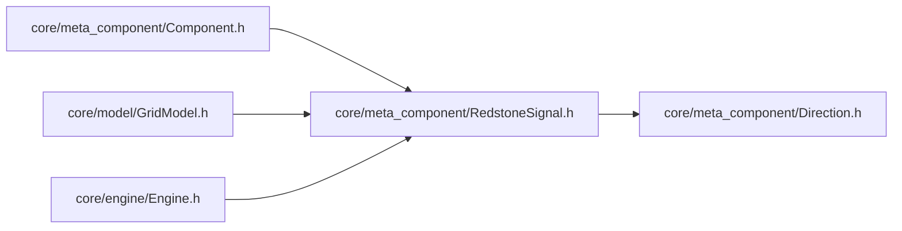

# RedstoneSignal — 红石信号结构体

> 对应源码：`core/meta_component/RedstoneSignal.h`
> 运行时测试：无专门测试文件（纯数据结构，字段语义由引擎与元件测试覆盖）

## 1. 职责定位

RedstoneSignal 是红石信号的**完整描述载体**：一个方向上的输入信号（强度 + 传播方向 + 充能类型）。它是纯数据 POD 结构，无任何方法，在引擎与元件之间传递信号信息。

**命名避让**：刻意避开 Qt 的 `signal` 关键字，防止与 Qt 信号槽机制混淆。

## 2. 字段语义

| 字段 | 类型 | 说明 |
|---|---|---|
| `strength` | int | 信号强度 0-15 |
| `direction` | Direction | 信号传播方向（指向的方向，即信号进入本格时来自的方向） |
| `isStrong` | bool | 是否为强充能 |

### 消费语义

- 消费方根据 `isStrong` 决定信号是否可用：**弱充能不能激活传输元件**（红石粉、火把等）
- `direction` 为信号传播方向：例如 `signalFrom(x, y, fromDir)` 返回的信号，其 `direction` 指向本格（即从 `fromDir` 邻居传来）

## 3. 设计契约

- **强度与充能类型正交**：`strength` 是纯强度值，`isStrong` 是布尔标志，二者独立——同强度可对应不同 isStrong，反之亦然
- **充能聚合规则**（消费方聚合多个方向输入时）：强度取所有方向最大值（max），强充能标志为布尔取或（任一方向强充能即强充能）——见"红石充能与防自激核心规则"
- **direction 语义固定**：永远是"传播方向/指向方向"，即进入当前格的方向；不随消费方视角变化
- **零成本**：POD 结构，无构造/析构开销，可直接放入 `std::array` / `std::vector` 密集存储（引擎 SignalCache 按 `[x][y][dirIndex]` 布局）

## 4. 使用约定

- **查询入口**：`GridModel::signalFrom(x, y, fromDir)` 构造信号——从 `fromDir` 方向邻居取信号，校验邻居 `canOutputTo` 后填充 `strength`（`outputStrength()`）、`direction`（`signalDir`）、`isStrong`（`isStrongOutput()`）
- **引擎快照**：Engine Phase 1 通过 `buildSignalCache` 按 `allDirections()` 顺序（North=0, East=1, South=2, West=3）预计算全网格信号快照，缓存数组下标即 Direction 枚举值
- **元件消费**：`Component::onTick(sigArray)` 接收 4 方向预计算信号，按下标取对应方向输入
- **空信号**：不可达方向（邻居为空或 `canOutputTo` 失败）返回 `{}`，即 strength=0、direction=None、isStrong=false

## 5. 模块关系

- 上游（依赖 RedstoneSignal）：Component（onTick 参数）、GridModel（signalFrom 返回类型）、Engine（SignalCache 元素类型）
- 下游依赖：Direction.h（direction 字段类型，信号方向语义复用方向模型）

## 6. 测试验证

无专门测试文件：结构体为字段级数据载体，其语义（isStrong 决定传输激活、direction 指向语义、聚合 max/取或规则）通过引擎集成测试与具体元件（SolidBlock、RedstoneDust 等）测试覆盖。

## 7. 变更历史

| 日期 | 变更 |
|---|---|
| 2026-08-04 | 首次成文，按当前三字段现状（strength / direction / isStrong）记录语义与使用约定 |
