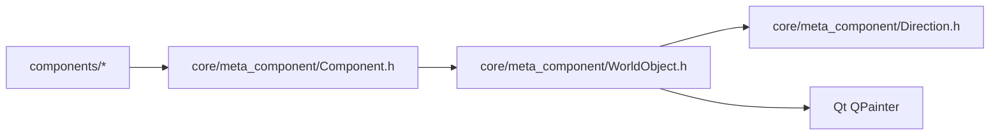

# WorldObject — 网格对象基类（占位 + 朝向 + 渲染）

> 对应源码：`core/meta_component/WorldObject.h`、`core/meta_component/WorldObject.cpp`
> 运行时测试：`tests/unit/core/meta_component/test_WorldObject.cpp`

## 1. 职责定位

WorldObject 是网格对象的最底层抽象，只负责三件事，不包含任何红石逻辑：

- **网格占位**：x/y 坐标及位移（`x()` / `y()` / `setPosition()`）
- **朝向与旋转**：`facing` 状态与方向 → 角度映射（`directionToAngle()`）
- **渲染**：Template Method——基类 `paint()` 非虚，处理朝向旋转；子类实现纯虚 `paintContent()`，只画**朝北版本**

红石逻辑（信号、端口、交互、Category 等）由 Component 层提供；WorldObject 不知道红石的存在。

## 2. 成员一览

| 成员 | 类型 | 说明 |
|---|---|---|
| `m_x` / `m_y` | int | 网格坐标（格子索引，非像素） |
| `m_facing` | Direction | 朝向，默认 `Direction::North` |

## 3. 接口清单

### 公开接口

| 接口签名 | 说明 |
|---|---|
| `WorldObject(int x, int y, Direction facing = Direction::North)` | 构造：初始化占位与朝向 |
| `int x() const` / `int y() const` | 网格坐标读取 |
| `void setPosition(int x, int y)` | 坐标更新 |
| `Direction facing() const` | 朝向读取 |
| `void setFacing(Direction d)` | 朝向设置 |
| `static int directionToAngle(Direction d) noexcept` | 朝向 → 旋转角度（顺时针）：`static_cast<int>(d) * 90`，North=0° / East=90° / South=180° / West=270° |
| `void paint(QPainter *painter, int cellSize) const` | 渲染入口：绕格子中心旋转后委托 `paintContent()`（非虚） |

### 子类接口（protected 纯虚）

| 接口签名 | 说明 |
|---|---|
| `virtual void paintContent(QPainter *painter, int cellSize) const = 0` | 子类必须实现：按**朝北**方向绘制元件内容；基类已处理朝向旋转，子类无需关心 facing |

## 4. 设计契约

- **Template Method 渲染模式**：`paint()` 非虚（`save → translate(中心) → rotate(angle) → translate(-中心) → paintContent → restore`），旋转逻辑集中在基类，子类只画朝北版本，避免每个元件重复旋转代码；`directionToAngle` 的 `static_cast<int>(d) * 90` 依赖 Direction 枚举按顺时针索引排列（0/1/2/3 = 0°/90°/180°/270°），该顺序已由 Direction.h 的 static_assert 契约组锁定
- **角度映射为硬编码约定**：方向 → 角度不放在 Direction.h 的 constexpr 纯函数集合中，而是 WorldObject 的成员——因为它只服务于渲染（QPainter 旋转），不属于方向代数模型
- **不含红石**：无 Category、无端口、无信号、无交互；这些归属 Component 层（见 [Component.md](./Component.md)）
- **纯 2D**：无 Z 轴、无 3D 预留抽象；3D 推广属未来从头设计

## 5. 使用约定

- 需要"能在网格上放置 + 有朝向 + 能绘制"但无红石行为的对象直接继承 WorldObject（实现 `paintContent` 即可实例化）
- 红石元件一律继承 **Component**（Component 再继承 WorldObject），不要直接继承 WorldObject 加红石逻辑
- 渲染代码永远按朝北绘制；实际朝向由基类 `paint()` 统一旋转，子类不得自行调用 `painter->rotate()`

## 6. 模块关系

- 上游（依赖 WorldObject）：Component 及全部具体元件（SolidBlock、Lever、RedstoneDust 等）
- 下游依赖：Direction.h（朝向类型与角度映射）、Qt QPainter（仅 .cpp 渲染实现）

## 7. 测试验证

测试文件：`tests/unit/core/meta_component/test_WorldObject.cpp`（5 个逻辑用例，标签 `unit`）

| 契约 | 测试函数 |
|---|---|
| 构造初始化坐标 | `initialPosition` |
| setPosition 更新坐标 | `setPosition_updates` |
| 默认朝向 North | `defaultFacing_isNorth` |
| setFacing 更新朝向 | `setFacing_updates` |
| directionToAngle 值表（4 方向） | `directionToAngle_values` |

**说明**：渲染相关测试（paint 委托 / 图像绘制）当前不覆盖，属逻辑测试范围之外，后续需要时再补。测试桩子类 `TestRenderObject` 以空 `paintContent` 实现满足纯虚要求。

## 8. 变更历史

| 日期 | 变更 |
|---|---|
| 2026-08-04 | 从 Component 拆分新建：网格占位、朝向（facing + directionToAngle）、Template Method 渲染（paint 非虚 + paintContent 纯虚）下沉至本类；Component 改为继承 WorldObject 并精简 | 
