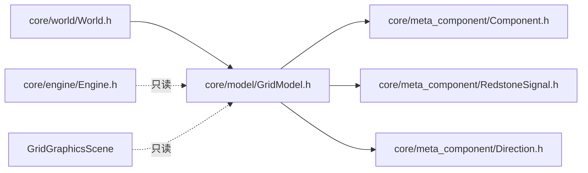

# GridModel — 网格模型（哑存储）

> 对应源码：`core/model/GridModel.h`、`core/model/GridModel.cpp`
> 运行时测试：无专门测试文件（待补，见第 7 节）

## 1. 职责定位

GridModel 是网格的**哑存储**：只负责**存储元件**（格子 + 活动列表 + 生命周期）与**获取/查询**（cellAt、signalFrom），不包含任何规则校验、事件通知或仿真逻辑。它是核心数据类，四层职责划分中唯一不持有任何"业务"的一层。

## 2. 成员一览

| 成员 | 类型 | 说明 |
|---|---|---|
| `m_width` / `m_height` | int | 网格尺寸（默认 0×0，由 World::resizeGrid 初始化，实际 16×16） |
| `m_grid` | `vector<vector<unique_ptr<Component>>>` | 格子数据，unique_ptr 自动管理元件生命周期（单层：每格最多一个元件） |
| `m_active` | `vector<Component*>` | 活动元件列表：place/remove 时同步增删，Engine 稀疏遍历避免扫描空气格（2.2 落地） |

## 3. 接口清单

### 尺寸

| 接口签名 | 说明 |
|---|---|
| `int width() const` / `int height() const` | 尺寸读取 |
| `bool isValid(int x, int y) const` | 越界判定 |
| `void resize(int w, int h)` | 尺寸调整（扩大/缩小均重建活动列表） |

### 格子操作

| 接口签名 | 说明 |
|---|---|
| `Component* cellAt(int x, int y) const` | 取元件（越界返回 nullptr） |
| `void placeComponent(int x, int y, std::unique_ptr<Component> comp)` | 放入格子（**覆盖放置**语义：旧元件移出活动列表后销毁）；不校验规则、不更新组件坐标 |
| `std::unique_ptr<Component> removeComponentAt(int x, int y)` | 移除并转移所有权（越界返回 nullptr；内部同步移出活动列表） |

### 查询（为上层服务）

| 接口签名 | 说明 |
|---|---|
| `RedstoneSignal signalFrom(int x, int y, Direction fromDir) const` | 实时信号查询：取 `fromDir` 方向邻居输出信号，校验邻居 `canOutputTo(opposite(fromDir))` 后填充 strength / direction / isStrong（Phase 2 BFS 传播用，每次实时计算） |
| `const std::vector<Component*>& activeComponents() const` | 活动元件列表（Engine 稀疏遍历用） |

## 4. 设计契约

- **哑存储**：place/remove 不校验规则（占用、附着、合法 ID 全由 World 负责）、不通知任何人（信号由 World 发）、不参与信号计算（signalFrom 只是查询封装，逻辑在元件 computeOutput）
- **所有权唯一**：所有元件归 GridModel 的 unique_ptr 管理；removeComponentAt 显式转移所有权——调用方决定销毁或复用（World::moveComponent 即复用该指针）
- **覆盖放置语义**：`placeComponent` 到已占用格子 = 旧元件销毁（先移出活动列表，防悬挂指针）——World::placeComponent 的占用预检使正常流程不会触发覆盖
- **placeComponent 不 setPosition**：存储只认格子索引，组件坐标由调用方维护（World::moveComponent 显式 `setPosition`；2026-08-04 修复移动后坐标残留 bug 时固化此约定）
- **活动列表一致性**：place/remove/resize 三处同步维护 m_active，Engine 三处遍历（Phase 1/2/3）依赖其与格子内容严格一致
- **signalFrom 语义**：`fromDir` 是"信号来自的方向"；邻居须能向对侧（`opposite(fromDir)`，即朝向本格）输出，否则返回空信号 `{}`（strength=0, direction=None, isStrong=false）
- **查询实时性**：signalFrom 每次计算，不做缓存——Phase 2 BFS 传播依赖实时性（2.5 架构约束：传播不读缓存）
- **2.5 计划**：signalFrom 构造的 RedstoneSignal 含 direction 死字段（现仅此处写入、零消费），重构时删（见 [RedstoneSignal.md](../meta_component/RedstoneSignal.md) 第 7 节）

## 5. 使用约定

- **写操作**：仅 World 调用（placeComponent / removeComponentAt / resize）
- **读操作**：World（cellAt / isValid 代理）、Engine（activeComponents / signalFrom / cellAt）、渲染层（width / height / cellAt）
- **UI 禁止直接持有**：交互层一律 World*；唯一例外是渲染层 GridGraphicsScene 构造注入只读访问
- **Engine 只读**：processTick 全程不修改网格结构

## 6. 模块关系

- 上游（依赖 GridModel）：World（写+读）、Engine（只读）、GridGraphicsScene（只读渲染）
- 下游依赖：Component（存储元素类型）、RedstoneSignal / Direction（signalFrom 返回类型与方向语义）
- 依赖方向：GridModel 是最底层数据模块，不依赖 World/Engine/UI 任何一层

## 7. 测试验证

当前**无专门单元测试文件**（`tests/unit/core/model/test_GridModel.cpp` 待补，延后安排见 v0.3.0-plan 2.4.2）。待补用例：

| 契约 | 用例 |
|---|---|
| 放置/读取/覆盖 | `placeComponent_*` |
| 移除成功/失败 + 所有权转移 | `removeComponentAt_*` |
| 越界安全（cellAt / remove / place 越界不崩溃） | `outOfBounds_*` |
| resize 后活动列表重建（扩大/缩小） | `resize_rebuildsActive` |
| 活动列表与格子内容一致性（增删同步） | `activeList_consistency` |
| signalFrom 邻居/对侧端口/空信号三路径 | `signalFrom_*` |

## 8. 变更历史

| 日期 | 变更 |
|---|---|
| 2026-08-04 | 首次成文（按当前最终代码：哑存储 + m_active 活动列表 + signalFrom 实时查询；核心内部零改动） |
