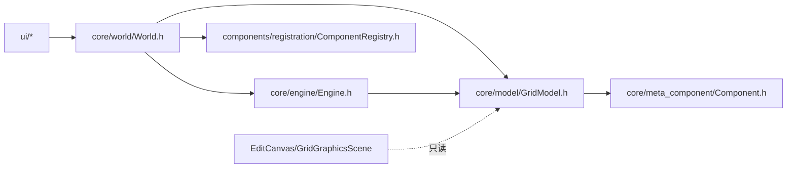

# World — 世界聚合根（编辑门面 + 仿真控制）

> 对应源码：`core/world/World.h`、`core/world/World.cpp`
> 运行时测试：无专门测试文件（编辑路径测试待补，见第 7 节）

## 1. 职责定位

World 是项目的**核心聚合根**：持有 GridModel（数据层）和 Engine（仿真层），统一对外暴露两类能力：

- **编辑操作**：放置 / 移除 / 移动 / 交互（唯一编辑入口，UI 不直接碰 GridModel）
- **仿真控制**：启动 / 停止 / 单步 / 调速（内部驱动 Engine + QTimer）

设计原则：**UI 只跟 World 说话**。所有对网格的写操作必须经 World（校验 → 调存储 → 发信号），GridModel 保持哑存储；Engine 只认识 GridModel，不感知 World/UI。

## 2. 成员一览

| 成员 | 类型 | 说明 |
|---|---|---|
| `m_grid` | `unique_ptr<GridModel>` | 网格模型（数据层，生命周期归 World） |
| `m_engine` | `unique_ptr<Engine>` | 仿真引擎（逻辑层，生命周期归 World） |
| `m_timer` | `QTimer*` | 仿真循环定时器（Qt 对象树管理） |
| `m_tick` | int | 已执行 tick 总数 |
| `m_running` | bool | 是否正在仿真 |
| `m_speed` | double | 速度倍率（间隔 = 100ms / speed，下限 10ms） |

## 3. 接口清单

### 编辑操作（唯一编辑入口）

| 接口签名 | 说明 |
|---|---|
| `bool placeComponent(int x, int y, const QString &componentId, Direction facing = Direction::North)` | 放置：校验（越界 / 占用 / Registry 创建失败）后入格；`ComponentRegistry::create` 在此内部调用 |
| `std::unique_ptr<Component> removeComponentAt(int x, int y)` | 移除：返回被移除的指针（所有权转移，失败返回 nullptr）；非空时发 `componentRemoved` |
| `bool moveComponent(int fromX, int fromY, int toX, int toY)` | 移动：remove + place **原子收口**，目标格非法/占用时回滚并返回 false；显式 `setPosition` 更新组件坐标 |
| `void interactAt(int x, int y)` | 交互：委托给元件内部 `onInteract()` |
| `Component* cellAt(int x, int y) const` | 只读查询代理（转发 GridModel） |
| `bool isValid(int x, int y) const` | 越界判定代理（转发 GridModel） |
| `void resizeGrid(int w, int h)` | 网格尺寸调整代理（转发 GridModel） |

### 仿真控制

| 接口签名 | 说明 |
|---|---|
| `void start()` / `void stop()` | 启动 / 停止定时器循环 |
| `void singleTick()` | 单步：`engine->processTick(grid)` + 清理标记元件 + `tick++` + 发 `tickCompleted` |
| `void setSpeed(double speed)` | 调速（运行中自动重启定时器） |
| `bool isRunning() const` / `int tickCount() const` | 状态查询 |

### 信号

| 信号 | 参数 | 说明 |
|---|---|---|
| `tickCompleted` | int tickCount | 每次 tick 完成后发射（UI 刷新画布、计数面板联动） |
| `componentPlaced` | int x, int y | 放置成功后发射 |
| `componentRemoved` | int x, int y | 移除成功后发射 |
| `componentInteracted` | int x, int y | 交互（onInteract）后发射 |

## 4. 设计契约

- **唯一编辑入口**：UI 层（InteractionManager 及全部 Interaction 子类）持有 `World*`；只有 World 能创建/移除/移动元件。例外：渲染层（EditCanvas / GridGraphicsScene）可只读 `grid()` 取尺寸与元件绘制
- **三段式操作模式**：每个编辑操作 = 校验 → 调 GridModel 存储 → 发信号（UI 由信号驱动刷新，替代手动 `m_scene->update()`）
- **moveComponent 原子性**：目标格非法/占用时回滚（元件放回原位），不产生半移动状态
- **removeComponentAt 返回 unique_ptr**：所有权显式转移，为未来 undo/redo（EditHistory）保留恢复能力
- **信号用坐标不用指针**：`componentRemoved` 等传 `(int, int)`——元件移除后指针失效，坐标无悬垂风险
- **仿真清理不发编辑信号**：`singleTick` 中标记元件清理直接调 GridModel（World 内部合法使用），`tickCompleted` 已驱动刷新，避免双刷新
- **Engine 无 World 依赖**：`processTick(GridModel*)`——引擎不感知 World 存在（2.4.1 四层职责共识）
- **GridModel 哑存储**：place/remove 存储实现留在 GridModel，World 只做规则与事件
- **入口先行、按需提取**：EditHistory（undo/redo）、存档（快照解耦，见 2.6）、PlacementRules 等需求立项后从 World 提取，不建空壳类

## 5. 使用约定

- **UI 编辑**：一律 `world->placeComponent / removeComponentAt / moveComponent / interactAt`，禁止直接操作 GridModel 写接口
- **UI 查询**：`world->cellAt / isValid`（统一走 World 代理）
- **UI 刷新**：连接 World 编辑三信号 + `tickCompleted` 刷新场景，不在编辑调用后手动 update
- **渲染层**：`world->grid()` 只读访问（GridGraphicsScene 构造注入）
- **测试**：scenario/custom 测试摆布电路应直用 World 接口（首个受益者，见 2.4 验证）

## 6. 模块关系

- 上游（依赖 World）：UI 层全部交互代码（InteractionManager / DesignPage / SimControlPanel）
- 下游依赖：GridModel（数据）、Engine（仿真）、ComponentRegistry（元件创建）
- 依赖方向：UI → World → { GridModel, Engine, Registry }，Engine → GridModel，单向无环

## 7. 测试验证

当前**无专门单元测试文件**（`tests/unit/core/world/test_World.cpp` 待补，延后安排见 v0.3.0-plan 2.4.2）。待补用例：

| 契约 | 用例 |
|---|---|
| 放置成功/失败（占用、越界、非法 ID） | `placeComponent_*` |
| 移除成功/失败 + 所有权返回 | `removeComponentAt_*` |
| 移动成功/回滚（目标占用） | `moveComponent_*` |
| 交互委托 onInteract | `interactAt_*` |
| 三编辑信号发射（坐标参数） | `signal_emitted` |
| singleTick 标记元件清理 | `singleTick_removesMarked` |

## 8. 变更历史

| 日期 | 变更 |
|---|---|
| 2026-08-04 | 编辑门面落地：新增 placeComponent / removeComponentAt / moveComponent / interactAt / cellAt / isValid / resizeGrid + 三编辑信号；Registry::create 收进 World；Engine::processTick 改为只依赖 GridModel（去 World 依赖）；UI 层全部改持 World*；顺带修复移动后组件坐标未更新的潜在 bug（moveComponent 显式 setPosition） |
| 2026-08-04 | 首次成文（按编辑门面落地后的最终代码） |
